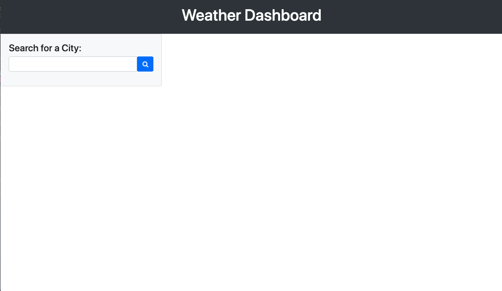
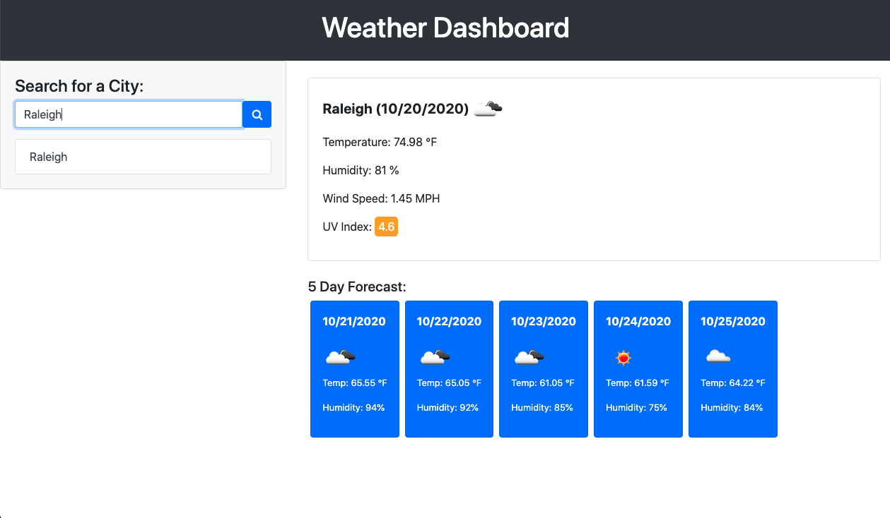
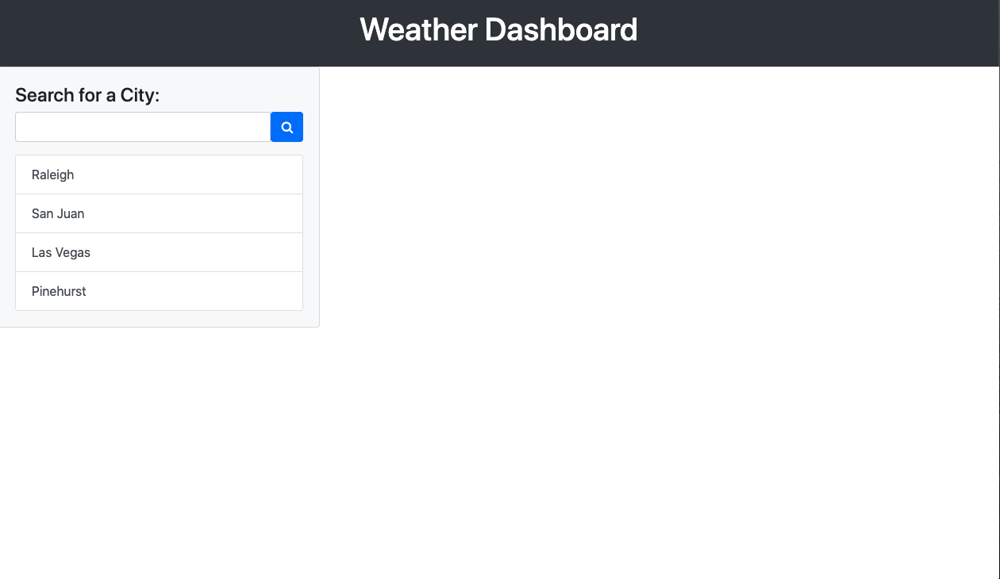
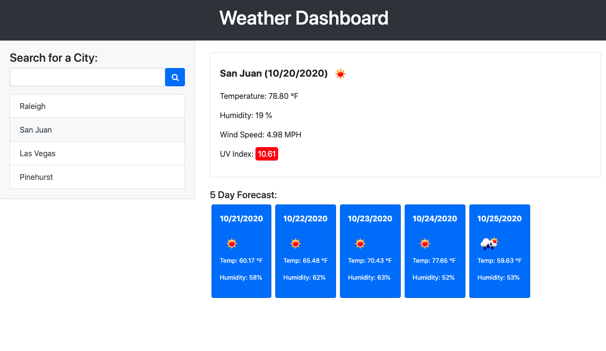

# 06 Server-Side APIs: WeatherDashboard

This README has been generated to accompany the completed Weather Dashboard. The purpose of the Weather Dashboard is to provide both the current weather and the five day forecast for a city that the user chooses. The displayed information will allow the user to plan their trip accordingly. Once the user searches for a city, it is added to the search history below the search bar. The user can then click on any city in the search history to retrieve its weather and forecast data again. This application has been made responsive and it features dynamically updated HTML and CSS (Bootstrap has been utilized). The goal of the Weather Dashboard is to gain experience using third-party APIs and to practice retrieving certain sets of information based upon the user input.

## Link to Deployed Page

[Weather Dashboard](https://duncangw1.github.io/WeatherDashboard/)

## Technologies Used

- HTML, CSS, Bootstrap, JavaScript, jQuery, Moment.js, OpenWeather API, Font Awesome

## APIs Used

[OpenWeather API](https://openweathermap.org/api)

### Specific API Sections Used

- Current weather information: ".../data/2.5/weather..."
- Current UV Index information: ".../data/2.5/uvi..."
- Future weather forecast: ".../data/2.5/forecast..."

## Screenshots

Landing Page

---

Example of City Search

---

Displaying City Search History

---

Clicking a City within Search History

---

## Contributors

- Gene Duncan (duncangw1)

## License & Copyright

© Gene Duncan
